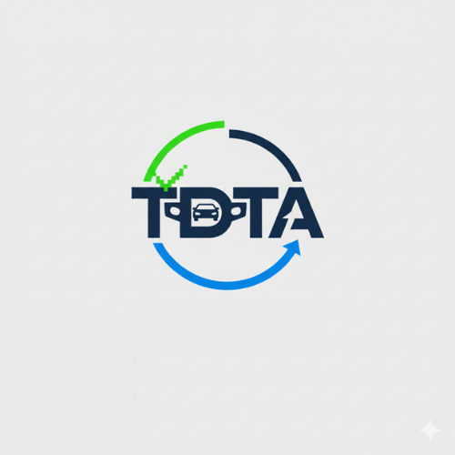

[](https://www.python.org/downloads/)

[](LICENSE)


# TDTA (Taiwan Driving Test Assistant) `v0.8.2`

**台灣監理站路考預約助手**
<p align = "center">
    
</p>


---

## 專案故事
在台灣，許多人剛滿 18 歲的第一個挑戰不是路考本身，而是「搶不到報名名額」。

看著監理站網站在一瞬間釋放名額又秒殺，許多人無奈之下被迫花錢尋求「代搶」服務。我認為報名駕照不應該成為一種負擔或商機，因此開發了 **TDTA**。

> **「這個軟體，讓你不再需要花錢請人代搶，而是可以靠自己成功報名人生第一張駕照。」**

---

## 功能亮點
* **⏲️自訂對時啟動**：可自由自訂啟動時間，全程不需要會寫程式碼，只需打開.exe就可以了^_^。
* **🤖自動化填寫**：支援個人資料、考試日期、監理站自動選取。

此程式目前只允許報名**普通重型機車初考**，還不接受重考之類的選項。

## 🛠️ 安裝與使用
1. **環境需求**：建議安裝 Python 3.11 以上版本。 (其他版本未測試)
2. **安裝依賴**：
   ```bash
   pip install selenium webdriver-manager
3. **安裝 Google Chrome**: [點我安裝 Google Chrome](https://support.google.com/chrome/answer/95346?hl=zh-Hant&co=GENIE.Platform%3DDesktop#zippy=)
4. **使用方法**：您可以透過[releases](https://github.com/0707rf/TDTA_bot/releases)查看最新版本，直接安裝 `TADA_bot-win.exe` 直接開啟使用，或是開啟 `main.py` 透過 **CMD** 啟用


## ⚠️ 啟動時間設定須知
建議打開 [**Time.is**](https://time.is/) 來查看您電腦的時間和 **實際** 的時間的 **誤差** 

> [!WARNING]
> **建議在搶票前30秒以前或1分鐘以前就開啟啟動此軟體，否則網頁加載速度可能會影響結果**

* 例如:
   * 左上角顯示"您的時間早了5.3秒"，你就可以自己回推。
   * 預計啟動時間為 `00:00:00` 那就設為 `00:00:05` or `00:00:06` 都可以。
   * 你也可以選擇維持 `00:00:00` 啟動都可以，只是可能會**過早**開啟或**過晚**開啟。(_需要自己判斷判_)

## 💻 執行畫面(Execution)

剛進入會顯示，請選擇報考分區。
```bash
請選擇地區:
1.臺北市區監理所（含金門馬祖）
2.臺北區監理所（北宜花）
3.新竹區監理所（桃竹苗）
4.臺中區監理所（中彰投）
5.嘉義區監理所（雲嘉南）
6.高雄市區監理所
7.高雄區監理所（高屏澎東）
輸入編號:
```

輸入完畢後，會跳出選擇你那個區的所有專理站。

```bash
請選擇地區:
1.臺中區監理所(臺中市大肚區瑞井里遊園路一段2號)
2.臺中市監理站(臺中市北屯路77號)
3.埔里監理分站(南投縣埔里鎮水頭里水頭路68號)
4.豐原監理站(臺中市豐原區豐東路120號)
5.彰化監理站(彰化縣花壇鄉南口村中山路二段457號)
6.南投監理站(南投縣南投市光明一路301號)
重新選擇地區輸入0
輸入編號:
```

一樣輸入完畢後，就開始填寫個人資料，跟考試日期(_建議先去官網上觀看下一期的考試日期日_)。

```bash
設定考試日期(報名考試日期):
生份證號(英文大寫):
生日:
名子:
電話:
電子信箱:
```

之後確認後，就填寫啟動時間，至於怎麼怎麼設定 **正確啟動時間** [查看上方啟動時間設定須知](#%EF%B8%8F-啟動時間設定須知) (請記得必須按照格式輸入 `00:00:00` 否則會失效)

------

## ⚠️關於防毒軟體誤報

本專案的執行檔(.exe) 是使用 **Pyinstaller** 將Python程式碼打包而成，這類打包方式經常會被Windows Defender或部分防毒軟體誤判為「木馬」或「不安全程式」
*這是正常現象*，請安心:
* 本專案完全 **開源** ，所有程式碼皆可在 `main.py` 中查看，絕無後門。
* 如果您有疑慮，建議您可以：
  1. **自行審查** `main.py` 源碼。 
  2. **手動執行**：不安裝 `exe` ，改為安裝 `Python` 環境並直接運行 
  ```bash
  python main.py
  ```
  3. **排除清單**：將 `TDTA_bot-win.exe` 加入防毒軟體的白名單 。


### 🛡️安全性聲明(Security)

本工具經過[VirusTotal](https://www.virustotal.com/)掃描，結果為 **65/71安全** 。
[點此查看 VirusTotal 完整掃描報告](https://www.virustotal.com/gui/file/b8ebf0805c43815ec1bb1299d7738b5d7d14d96509801c9674326508ecddbbc4/detection)

---

## ⚠️隱私聲明(Privacy Statement)
* **本程式個資僅存於本地端，不會上傳至任何第三方伺服器**

---

## 💬 關於我 (Contact)
如果有任何問題，歡迎透過 Discord 聯繫我：
* **Discord ID**: `0707rf`
[點我聯絡 Discord](https://discordapp.com/users/0707rf)


我也是一個小白還有許多東西還不會，歡迎大師指點。


---

## ⚖️ 免責聲明 (Disclaimer)

使用本專案（以下簡稱「本程式」）即表示您同意以下條款：

1. **僅供技術交流**：本程式僅供程式設計愛好者作為技術研究與學術交流之用，請勿將其用於任何違反中華民國法律之行為。
2. **遵守服務條款**：使用者在執行本程式前，應自行閱讀並遵守「監理服務網」之服務條款。任何因過度頻繁請求導致之 IP 封鎖或帳號停權，作者概不負責。
3. **無擔保責任**：本程式依「現狀」提供，作者不保證程式之穩定性、完整性或預約成功之結果。使用本程式所產生之任何直接、間接損害（包括但不限於預約失敗、電腦故障等），作者不負任何賠償責任。
4. **禁止商用**：本程式旨在維護預約公平性，嚴禁任何個人或團體利用本程式進行代搶收費、牟利等行為。

**如果您不同意上述條款，請立即停止使用並刪除本程式碼。**
